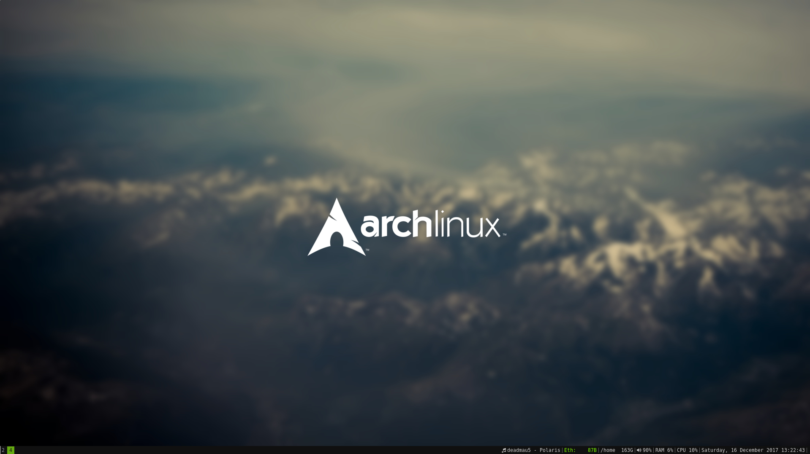

brandonio21 dotfiles
====================
The main purpose of this repo is to hold the configuration files that I use
across my systems. Of course, if you want to use these configuration files,
you're more than welcome to.

Installation
------------
To install, simply `./install.sh` and follow the prompts.

Details
-------
This repo contains settings for the following:  
* vim
* i3wm
* bash

Screenshots
-----------

