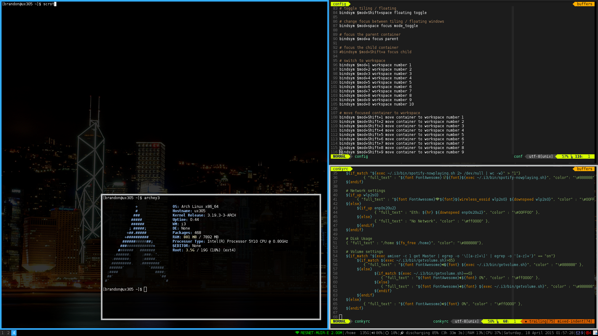

i3
==

i3 window manager configuration

used by brandonio21 and should, in theory, be downloaded onto all my machines
before coding starts.

* Uses conky for status bar
* Uses termite for terminal
* Uses slimlock for lock screen
* Uses feh to set the arch wallpaper

## Installation ##
Run `install.sh`.

